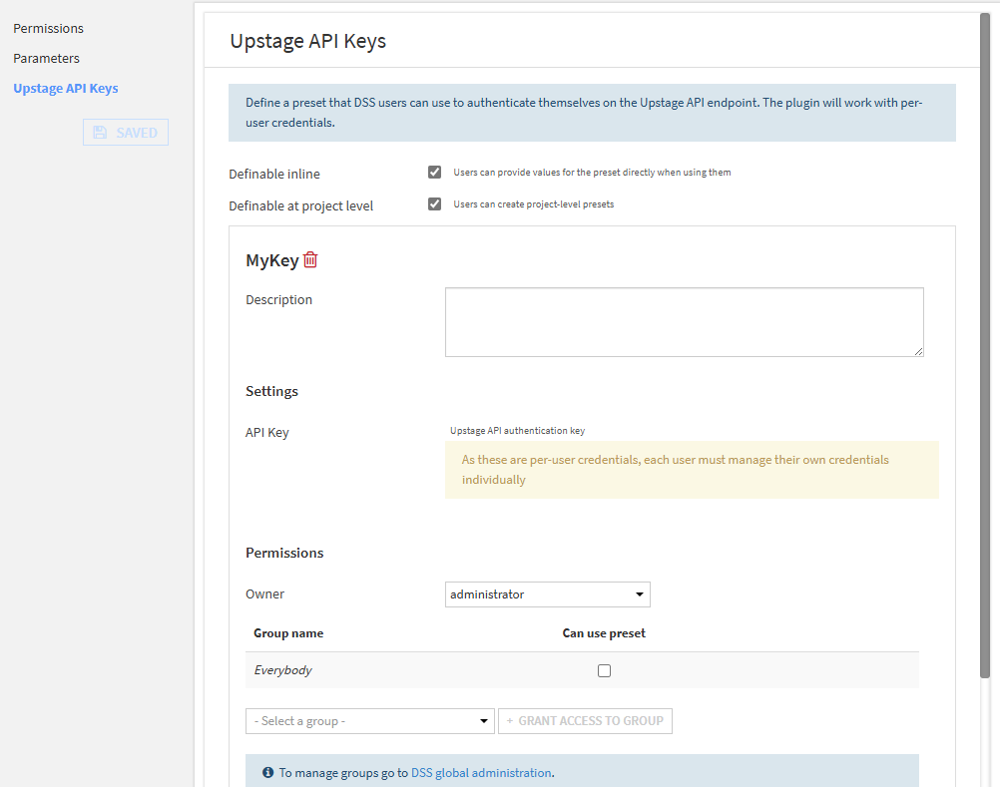
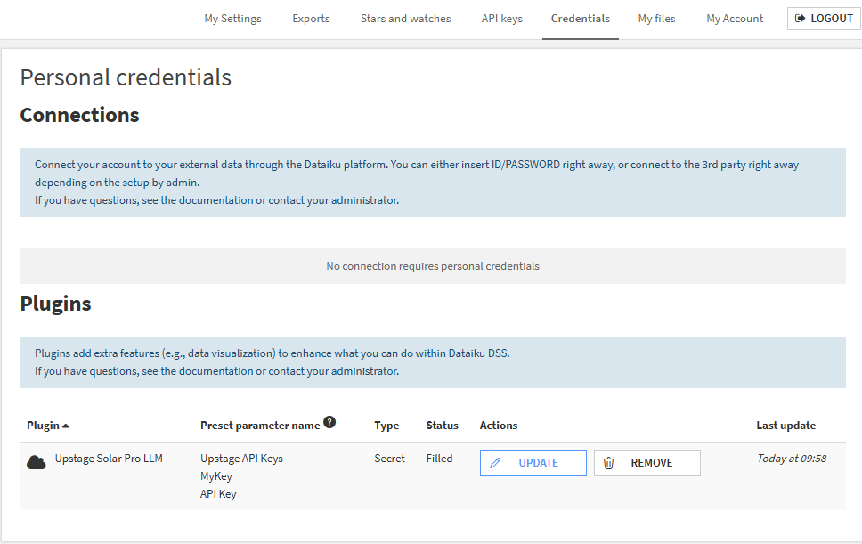
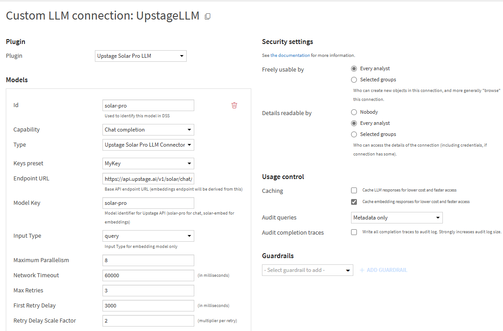
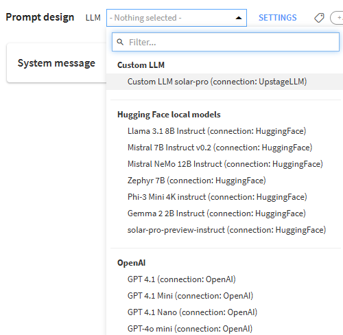

# Upstage Solar Pro - Generative AI Plugin

With this plugin, you can leverage LLMs from [Upstage](https://upstage.ai), including solar-pro for chat completions and solar-embed for embeddings.

# Capabilities

- Custom LLM connection for Upstage's Solar Pro models
- Connect to Upstage's solar-pro chat completion endpoint to use in Dataiku Prompt Studios, LLM recipes, and via the LLM Mesh Python APIs
- Connect to Upstage's solar-embed embedding endpoint to use in the Dataiku Embed recipe for Retrieval Augmented Generation (RAG)

# Limitations

- Must use Dataiku >= v13.3.0
- Must have an Upstage API Key
- Must have access to Upstage Solar Pro services

## Setup access to Upstage API

- An Upstage account and API key are required to access Solar Pro models
- Visit [Upstage Console](https://console.upstage.ai) to get your API key

## Setup the plugin in Dataiku

- Install the Plugin using the [installation guide](https://doc.dataiku.com/dss/latest/plugins/installing.html)
- Go to Plugins → Installed → Upstage Solar Pro Plugin → Settings → Add Preset → Define a Preset Key

- Every user can set up the preset under their Dataiku profile → API Credentials → Credentials → Plugin credentials. Click the Edit icon and paste your Upstage API key

## Setup the Solar Pro Connection in Dataiku
- Go to Administration → Connections → New Connection → Custom LLM (LLM Mesh)

- Provide a connection name and select Upstage Solar Pro Connector in the Plugin dropdown

- To add models - Click Add Model
    - **Id**: Unique name to identify model
    - **Capability**: Chat Completion / Text Embedding
    - **Type**: Upstage Solar Pro LLM Connector
    - **Keys Preset**: Select the preset name defined in the plugin setting
    - **Endpoint URL**: Provide complete URL (examples below)
        - For chat completion - https://api.upstage.ai/v1/solar/chat/completions
        - For embeddings - https://api.upstage.ai/v1/solar/embeddings
    - **Model Key**: Provide the model key (solar-pro for chat, solar-embed for embeddings)
    - **Input Type** (This property only applies to Embedding models. By default, it is set to query): query or passage

Once the setup is complete, you can access Upstage models both in LLM Powered Visual Recipes, Prompt Studios and using Python and REST LLM Mesh APIs. 